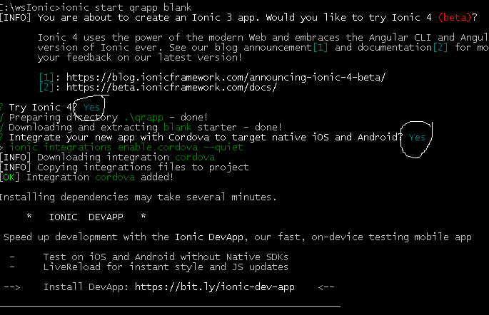
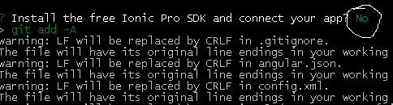
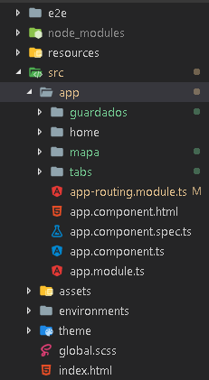

# QRAPP

Demo experimental en ionic 4 de app de curso de instructor Fernando Herrera.

## Creación de proyecto

> ionic start qrapp blank

Elegí que instalara ionic 4, cordova y omito ionic pro sdk.

### Primeros elementos

> ionic g page guardados

> ionic g page mapa

> ionic g page tabs

El proyecto en ionic 4 ahora tiene la estructura siguiente:

Iconos de ionic pueden ser consultados aquí:

https://ionicframework.com/docs/ionicons/

## Cambios de version 4

La forma de enrutamiento en los tabs es extremadamente diferente. Aquí una guia:

https://medium.com/@sandipmann/routing-in-ionic-4-84cb052cbe51

